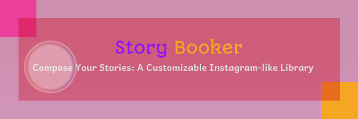

  
  <h1>Story Booker</h1>
  

> Bring Stories To Life: A Jetpack Compose Library for Instagram-like Stories

### Demo

https://github.com/nadavshalev67/Story-Booker/assets/36004285/b9a3ef0c-ea4e-4f6c-8ba7-2dcdd8b478e6

### Features

- Craft Instagram-style stories with full design flexibility:.
  These include:
    - Customize Story Thumbnails Gallery with fine-tuned specifics:
       - Adjustable story size and border size
       - Personalized text styling for distinctive narration
       - Modifiable circle size and border size to suit varied presentation needs
       - Multiple image sourcing capabilities: Thumbnails can load images through URL, Drawable resource or solid color for flexible design
     - Customize Story Content Gallery:
       - Fully customizable, you can render your own Composable on it
       - Time-adjustable top bars: Offers duration customization for versatile storytelling timings.
       - Smooth transitions: Offers cubic transition animations between pages for a seamless viewing experience.
  Achieve all this and more in just a few lines of code, saving time and enhancing productivity.
   

